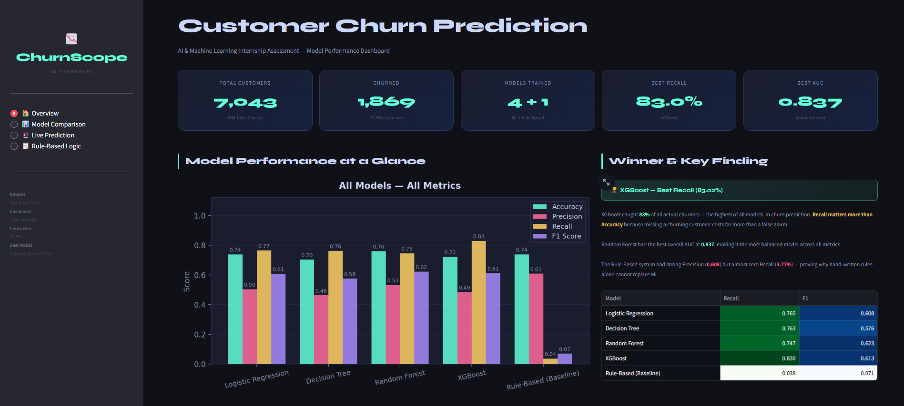
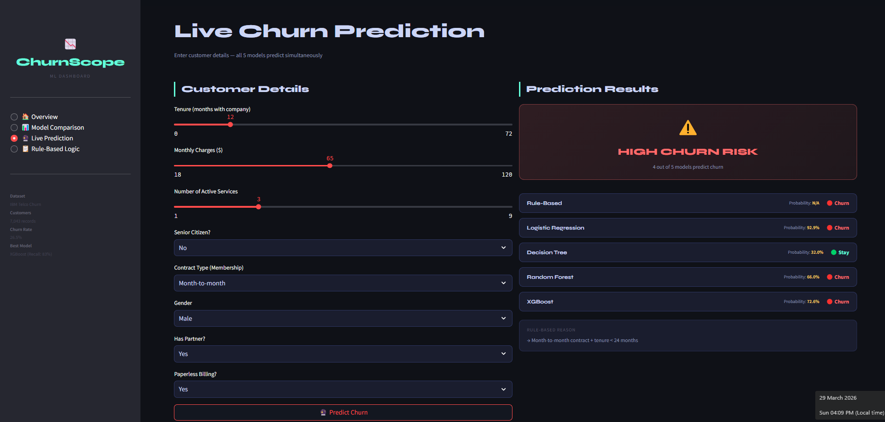
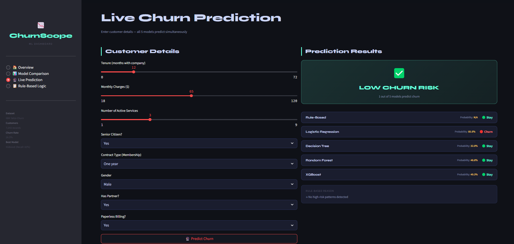
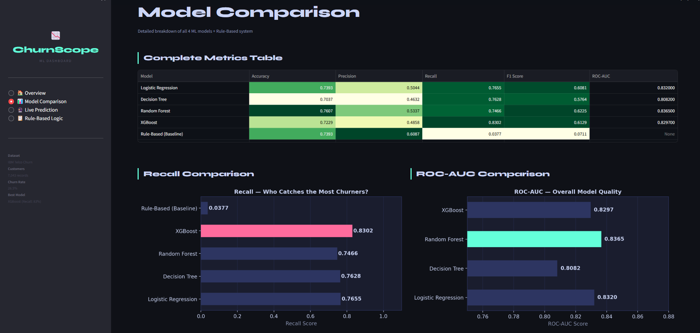
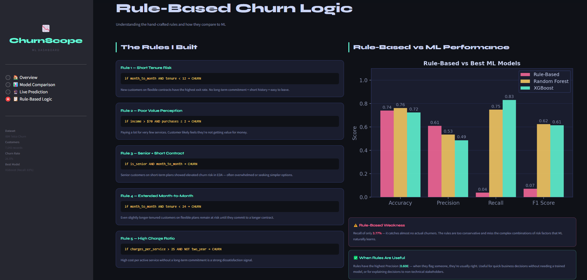

# Customer Churn Prediction
**AI & Machine Learning — Internship Assessment**


---

## Problem Description

Customer churn is when existing customers stop using a company's services, which directly impacts revenue and growth. The goal of this project was to build a machine learning pipeline that predicts which customers are likely to churn before it actually happens, using the IBM Telco Customer Churn dataset from Kaggle containing 7,043 customer records.
Four machine learning models were trained and compared, Logistic Regression as the baseline, Decision Tree for interpretability, Random Forest for ensemble strength, and XGBoost as the final champion. A simple rule-based system was also built alongside the ML models to show the difference between hand-crafted logic and learned patterns. 
XGBoost achieved the highest Recall of 83%, meaning it caught the most actual churners, which matters most in this problem since missing a churning customer costs far more than a false alarm

---

## Live Prediction Dashboard Preview











----
## Dataset

**IBM Telco Customer Churn** — [Kaggle Link](https://www.kaggle.com/datasets/blastchar/telco-customer-churn)

| Property | Value |
|----------|-------|
| Total Customers | 7,043 |
| Features | 21 columns |
| Churned Customers | 1,869 (26.5%) |
| Non-Churned | 5,174 (73.5%) |

The dataset had a class imbalance — only 26.5% actually churned. I handled
this using SMOTE on the training set before fitting any model.

**How I mapped the columns to match the task spec:**

| Task Spec | Dataset Column | Notes |
|-----------|---------------|-------|
| Age | `SeniorCitizen` | Binary age-group flag |
| Income | `MonthlyCharges` | Monthly billing amount |
| Purchases | Derived column | Count of active services per customer |
| Membership | `Contract` | Month-to-month / 1yr / 2yr |
| Churn | `Churn` | Direct match |

---

## Project Structure

```
customer-churn-prediction/
│
├── notebook/
│   └── churn_analysis.ipynb       # Full pipeline notebook
│
├── data/
│   ├── raw/
│   │   └── WA_Fn-UseC_-Telco-Customer-Churn.csv
│   └── processed/
│       └── churn_cleaned.csv
│
├── results/
│   ├── churn_distribution.png
│   ├── feature_distributions.png
│   ├── correlation_heatmap.png
│   ├── membership_payment_churn.png
│   ├── confusion_matrices.png
│   ├── roc_curves.png
│   ├── model_comparison_bar.png
│   ├── feature_importance.png
│   └── model_comparison.csv
│
├── models/
│   ├── logistic_regression.pkl
│   ├── decision_tree.pkl
│   ├── random_forest.pkl
│   ├── xgboost.pkl
│   └── scaler.pkl
│
├── model_comparison_summary.md
├── requirements.txt
├── .gitignore
└── README.md
```

---


## Results

### Model Comparison

| Model | Accuracy | Precision | Recall | F1 Score | ROC-AUC |
|-------|----------|-----------|--------|----------|---------|
| Logistic Regression | 0.7393 | 0.5044 | 0.7655 | 0.6081 | 0.832 |
| Decision Tree | 0.7037 | 0.4632 | 0.7628 | 0.5764 | 0.808 |
| Random Forest | 0.7607 | 0.5337 | 0.7466 | 0.6225 | **0.837** |
| **XGBoost** ✅ | 0.7229 | 0.4858 | **0.8302** | 0.6129 | 0.8297 |
| Rule-Based | 0.7393 | 0.6087 | 0.0377 | 0.0711 | — |

### Why XGBoost Wins

The metric that matters most here is **Recall** — catching as many actual
churners as possible. Missing a churner costs the business far more than
flagging a false alarm.

XGBoost caught **83% of all churning customers** (lowest missed churners: 63),
which is why it's the recommended model despite having slightly lower accuracy
than Random Forest.

Random Forest is a close second — it had the best overall AUC (0.837) and
the most balanced confusion matrix.

---

## Key Findings From EDA

- Customers on **month-to-month contracts** churn at nearly 3× the rate of
  those on two-year contracts — this was the strongest single signal
- New customers (tenure < 12 months) are the most vulnerable window
- High monthly charges with few active services strongly correlates with churn
- Senior citizens on short-term contracts showed elevated risk
- Gender had virtually zero correlation with churn

---

## Rule-Based Logic

Alongside ML, I built a simple hand-coded rule system based on EDA observations:

```python
def rule_based_churn(row):
    if month_to_month and tenure < 12:
        return 1   # High risk
    if income > 70 and purchases <= 2:
        return 1   # Paying a lot, using very little
    if is_senior and month_to_month:
        return 1   # Vulnerable segment
    return 0
```

It achieved 73.9% accuracy but only 3.77% Recall — it caught almost no
churners. This shows why hand-written rules alone can't replace ML when
the patterns are subtle and multi-dimensional.

---

## Tech Stack

```
pandas        — data loading and cleaning
numpy         — numerical operations
matplotlib    — plotting
seaborn       — statistical visualizations
scikit-learn  — models, preprocessing, evaluation
xgboost       — gradient boosting
imbalanced-learn — SMOTE for class imbalance
joblib        — model saving
```

---

## What I'd Improve Next

- Proper hyperparameter tuning with Optuna
- SHAP values for per-customer explainability
- Stacking ensemble combining all four models
- Simple Flask API to serve live predictions

---

*[Janarthvasan P] — Internship Assessment Submission*  
*Dataset: IBM Telco Churn via Kaggle*
